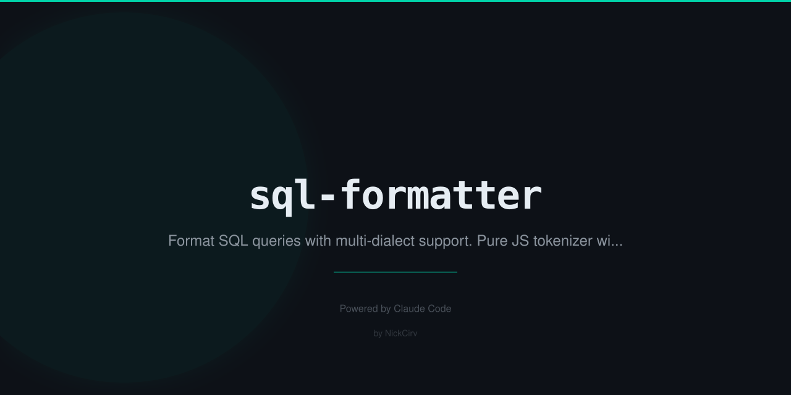

# sql-formatter

Format and pretty-print SQL queries from the command line. Pure JS tokenizer. Zero external dependencies.

## Features

- Format SQL files or pipe from stdin
- Write formatted output to a file
- Format all `.sql` files in a directory
- Multiple SQL dialects: `mysql`, `postgres`, `sqlite`, `mssql`, `generic`
- Configurable indent size
- Uppercase or lowercase keyword normalization
- `--check` mode for CI pipelines (exits 1 if not formatted)
- `--watch` mode to auto-format on file change
- `--json` output for tooling integration
- Pure Node.js — no npm install required

## Install

```bash
npm install -g sql-formatter
```

Or run directly without installing:

```bash
npx sql-formatter query.sql
```

## Usage

```
sql-formatter <file.sql>                  Format a SQL file (prints to stdout)
sql-formatter <file.sql> --output out.sql Write formatted SQL to file
sql-formatter <dir>                       Format all .sql files in directory
echo "SELECT 1" | sql-formatter           Read from stdin
```

## Options

```
--dialect <name>  SQL dialect: mysql|postgres|sqlite|mssql|generic (default: generic)
--indent <n>      Indent size in spaces (default: 2)
--uppercase       Uppercase SQL keywords
--lowercase       Lowercase SQL keywords
--output <file>   Write output to file instead of stdout
--check           Exit 1 if file(s) not formatted (for CI)
--watch           Watch file and auto-format on change
--json            Output metadata as JSON
--help, -h        Show this help
--version, -v     Show version
```

## Examples

Format a file and print to stdout:

```bash
sql-formatter query.sql
```

Format with uppercase keywords and 4-space indent:

```bash
sql-formatter query.sql --uppercase --indent 4
```

Format and write to a new file:

```bash
sql-formatter query.sql --output formatted.sql
```

Format all `.sql` files in a directory:

```bash
sql-formatter ./migrations
```

Pipe from stdin:

```bash
echo "select id,name from users where id=1" | sql-formatter --uppercase
```

Output:

```sql
SELECT id,
  name
FROM users
WHERE id = 1
```

Check formatting in CI (exits 1 if any file is not formatted):

```bash
sql-formatter . --check
```

Get JSON metadata:

```bash
sql-formatter query.sql --json
# { "file": "/path/to/query.sql", "changed": true, "linesBefore": 1, "linesAfter": 4 }
```

Watch and auto-format on save:

```bash
sql-formatter query.sql --watch
```

Use as `sqlfmt` alias:

```bash
sqlfmt query.sql --uppercase
```

## What Gets Formatted

- Each major clause (`SELECT`, `FROM`, `WHERE`, `JOIN`, `GROUP BY`, `ORDER BY`, etc.) starts on a new line
- Comma-separated items are one per line with indentation
- Nested subqueries are indented in parenthesized blocks
- Short expressions are inlined; long ones are expanded
- Consistent spacing around operators (`=`, `!=`, `<`, `>`, `<=`, `>=`)
- Inline vs multiline parentheses decided automatically (threshold: 50 chars)
- Comments are preserved in place
- Multiple statements separated by blank lines

## Supported Keywords

SELECT, FROM, WHERE, JOIN (INNER/LEFT/RIGHT/FULL/CROSS/NATURAL), ON, GROUP BY, ORDER BY, HAVING, LIMIT, OFFSET, INSERT INTO, VALUES, UPDATE, SET, DELETE FROM, CREATE TABLE, ALTER TABLE, DROP TABLE, WITH (CTE), UNION, UNION ALL, INTERSECT, EXCEPT, AS, AND, OR, NOT, IN, EXISTS, CASE WHEN THEN ELSE END, COALESCE, CAST, DISTINCT, BETWEEN, LIKE, IS NULL, IS NOT NULL, and more.

## Supported Dialects

| Dialect | Notes |
|---------|-------|
| `generic` | Standard SQL (default) |
| `mysql` | MySQL/MariaDB |
| `postgres` | PostgreSQL (dollar-quoted strings, `::` cast) |
| `sqlite` | SQLite |
| `mssql` | Microsoft SQL Server |

Dialect selection primarily affects tokenizer edge cases. The core formatting rules are dialect-agnostic.

## Requirements

- Node.js >= 18
- Zero npm dependencies

## License

MIT
