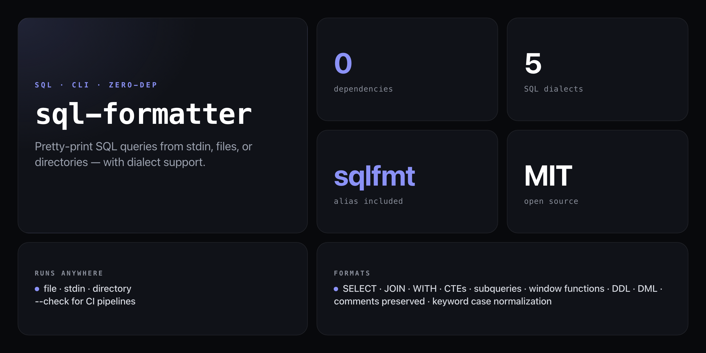

<div align="center">

**Format and pretty-print SQL queries from the command line. Zero external dependencies.**


</div>

---

A pure Node.js SQL formatter with a hand-rolled tokenizer and zero npm dependencies. Pipe from stdin, format a single file, or batch-format an entire directory. Clause-aware indentation, keyword case normalization, and a `--check` mode for CI make it a drop-in step in any SQL workflow.

```
echo "select id,name from users where id=1" | npx github:NickCirv/sql-formatter --uppercase
```

Output:

```sql
SELECT id,
  name
FROM users
WHERE id = 1
```

## Install

No install required — run straight from GitHub with zero dependencies:

```bash
npx github:NickCirv/sql-formatter
```

## Usage

```bash
# Format a SQL file (prints to stdout)
npx github:NickCirv/sql-formatter query.sql

# Write formatted output to a file
npx github:NickCirv/sql-formatter query.sql --output formatted.sql

# Format all .sql files in a directory (in-place)
npx github:NickCirv/sql-formatter ./migrations

# Pipe from stdin
echo "select id,name from users where id=1" | npx github:NickCirv/sql-formatter --uppercase

# Check formatting in CI (exits 1 if not formatted)
npx github:NickCirv/sql-formatter . --check

# Watch a file and auto-format on save
npx github:NickCirv/sql-formatter query.sql --watch

# Get JSON metadata
npx github:NickCirv/sql-formatter query.sql --json
# { "file": "/path/to/query.sql", "changed": true, "linesBefore": 1, "linesAfter": 4 }
```

## Options

| Flag | Description |
|------|-------------|
| `--dialect <name>` | SQL dialect: `mysql` \| `postgres` \| `sqlite` \| `mssql` \| `generic` (default: `generic`) |
| `--indent <n>` | Indent size in spaces (default: `2`) |
| `--uppercase` | Uppercase SQL keywords |
| `--lowercase` | Lowercase SQL keywords |
| `--output <file>` | Write output to file instead of stdout |
| `--check` | Exit `1` if file(s) not formatted (for CI) |
| `--watch` | Watch file and auto-format on change |
| `--json` | Output change metadata as JSON |
| `--help, -h` | Show help |
| `--version, -v` | Show version |

## What gets formatted

- Each major clause (`SELECT`, `FROM`, `WHERE`, `JOIN`, `GROUP BY`, `ORDER BY`, etc.) starts on a new line
- Comma-separated items are one per line with indentation
- Nested subqueries are indented inside parenthesized blocks
- Short expressions are inlined; long ones are expanded (threshold: 50 chars)
- Consistent spacing around operators (`=`, `!=`, `<`, `>`, `<=`, `>=`)
- Comments are preserved in place
- Multiple statements separated by blank lines

## Supported dialects

| Dialect | Notes |
|---------|-------|
| `generic` | Standard SQL (default) |
| `mysql` | MySQL / MariaDB |
| `postgres` | PostgreSQL (dollar-quoted strings, `::` cast) |
| `sqlite` | SQLite |
| `mssql` | Microsoft SQL Server |

Dialect selection affects tokenizer edge cases (e.g. `$$`-quoted strings in Postgres, `::` cast operator). Core formatting rules are dialect-agnostic.

## CI usage

Exit code is `1` if any file is unformatted, `0` if clean:

```yaml
- name: Check SQL formatting
  run: npx github:NickCirv/sql-formatter . --check
```

## sqlfmt alias

The binary is also available as `sqlfmt` — useful when you want a shorter command in scripts:

```bash
sqlfmt query.sql --uppercase --indent 4
```

## What it is NOT

- **Not a linter or validator.** It formats structure — it does not catch SQL errors, warn about deprecated syntax, or enforce naming conventions.
- **Not dialect-strict.** Dialect selection affects a few tokenizer edge cases; it does not enforce dialect-specific syntax rules.
- **Not a library.** The CLI is the interface. There is no published npm package to `require()` — run it via `npx github:NickCirv/sql-formatter`.

---

<div align="center">
<sub>Zero dependencies · Node 18+ · MIT · by <a href="https://github.com/NickCirv">NickCirv</a></sub>
</div>
