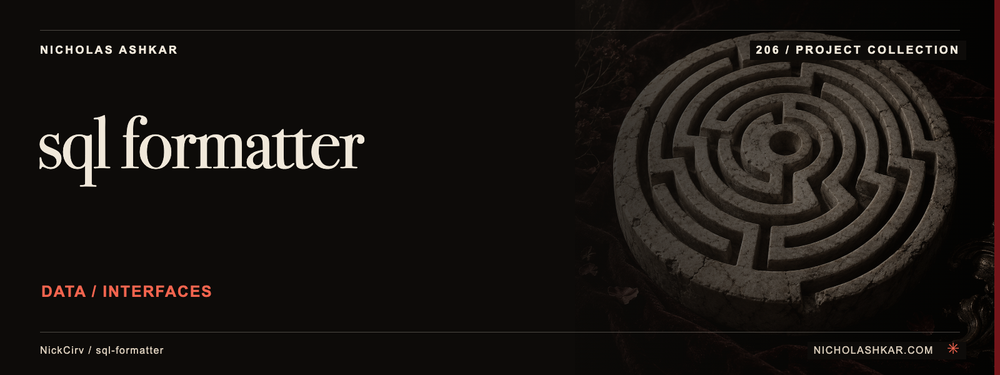

# sql-formatter

Format local SQL text with a small tokenizer-based command-line tool.

Reads a file or stdin, controls keyword case/indentation and offers check, watch and output-file modes. Dialect names select supported formatter options.


<a id="install"></a>

## Quickstart

Package runtime requirement: Node.js `>=20`. Git is needed to obtain this pinned source checkout.

```bash
git clone https://github.com/NickCirv/sql-formatter.git
cd sql-formatter
git checkout 8528ee665789771a2d718f4c8930db765901918c
node index.js test.sql --check
```

This source-derived example has not been executed in this review. The bundled SQL fixture is compared with formatter output. Exit 1 can mean formatting differs; it is not necessarily a parser failure.


<a id="options"></a>

<a id="what-gets-formatted"></a>

<a id="supported-dialects"></a>

<a id="sqlfmt-alias"></a>

## Usage

```bash
printf '%s\n' 'select id,name from users where id=1' | node index.js --uppercase
node index.js query.sql --output formatted.sql
node index.js ./queries --check
```

A single file prints to stdout by default. **A directory argument rewrites its immediate .sql files in place unless `--check` is set.** `--watch` also rewrites the watched file.

[Command reference](docs/REFERENCE.md) covers arguments, modes and output controls.


<a id="what-it-is-not"></a>

## Behavior and limits

This is a formatter, not a SQL validator or migration runner. Supported dialect names do not imply complete grammar coverage. The directory scan is nonrecursive. Inspect diffs and test SQL semantics before using formatted output, especially for procedural or dialect-specific constructs. This project’s name overlaps other packages; use the explicit repository checkout.


<a id="ci-usage"></a>

## Development

Declared package scripts:

| Script | Command |
| --- | --- |
| `test` | `node --test` |

The smoke test syntax-checks the entrypoint; it does not exercise CLI behavior or integrations.

## Research

[Source review and claim ledger](docs/RESEARCH.md) records revision `8528ee665789`, inspected files and verification gaps.

## License and attribution

Protected license and attribution files remain unchanged: [LICENSE](https://github.com/NickCirv/sql-formatter/blob/8528ee665789771a2d718f4c8930db765901918c/LICENSE).

[Artwork credits](assets/nicholas-ashkar/CREDITS.md) · [Nicholas Ashkar — consulting](https://nicholashkar.com/#oxblood-contact)
